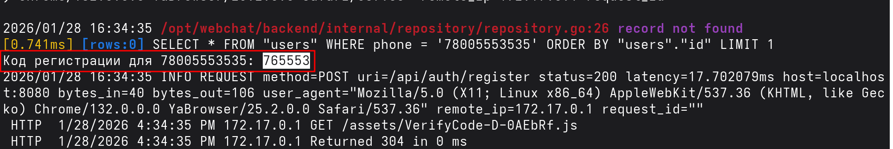

# WebChat

- Пользователи могут общаться друг с другом в приватных чатах;
- Любой пользователь может создавать групповые чаты, в которых может приглашать своих друзей, либо пользователей, номера которых ему известны;
- есть скрытые групповые чаты, есть те которые будут отображаться в "Публичных чатах", в них может вступить любой пользователь после одобрения заявки от содателя чата;
- пользователь находящийся в скрытом или публичном чате может добавлять других пользователей по контакту;
- можно удалять пользователей из друзей и другое...


- при регистрации код для подтверждения появляется в консоли.




Пользователь **Алексей** - номер: 79082796394 пароль: aaaaaa9

Пользователь **Мария** - номер: 79083795623 пароль: barsik23

Пользователь **Дмитрий** - номер: 79022383848 пароль: adka_lf_ewf

Пользователь **Екатерина** - номер: 79996782365 пароль: @afkjфаыфва

Пользователь **Иван** - номер: 72390239038 пароль: ___@fanslkf

Пользователь **Ольга** - номер: 72342383826 пароль: _2asdf323

### Запуск

```bash
$ docker build -t webchat .
$ docker run --rm -p 3000:3000 -p 8080:8080 -p 5432:5432 webchat
```
